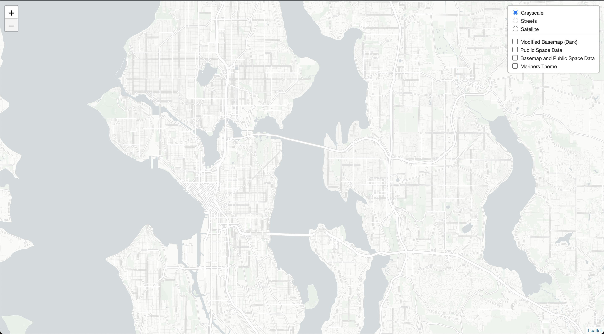

# MapTiles

> ### Repository Information
> In this lab on maptiles I created 4 maptile layers for seattle. Before I go into details on those specifically I am going to discuss the the repository. Each of the tile sets have a zoom level between 12 and 14 with the default being 12 when it is loaded up. All of the maptiles are in the assets folder and each one of the 4 folders corresponds with each one of the different map layers. In the data SeattleData folder there is a data set in which I created one of my map layers with. Lastly the img folder holds all of the images of the maps I created and one of them is the photo I used when using the cartogram feature in mapbox studio (Mariners logo). The link to html can be found here: [Maptiles over Seattle](https://tnh333.github.io/MapTiles/Maptiles.html)

#### Maptile 1: Mapbox Basemap

This basemap is a basic mapbox basemap that is grayscale and relatively plain

#### Maptile 2: Mapbox Basemap Modified (Dark)

This is a basemap from mapbox that I modified and made darker. Still very simple, and easy to see.

#### Maptile 1: Mapbox Basemap with Public Space Seattle Data

This map is using the first basic mapbox basemap and adding some Seattle data to it. The data comes from [Seatle's open source datasets](https://data-seattlecitygis.opendata.arcgis.com/datasets/SeattleCityGIS::public-and-open-spaces-in-seattle-1/explore?layer=1&location=47.616024%2C-122.339400%2C12.17&showTable=true). The data is showcasing all of the spaces in Seattle that are open to the public and outdoors. My original theme was going to be areas to play sports, but was unable to find data on this so I figured this was similar. 

#### Maptile 1: Modified Basemap with Public Space Seattle Data

This map is similar to the above map except that I used the modified basemap from the second map. 

#### Maptile 1: Mariners Theme Map

This last map is a map made with mapbox's [Cartogram](https://apps.mapbox.com/cartogram/#9.68/47.6291/-122.3472) which allows you to add a photo which creates a theme for the map based on the photo of choice. I decided to use the Mariners logo for my themed map. Here is the photo I used for cartogram: 

